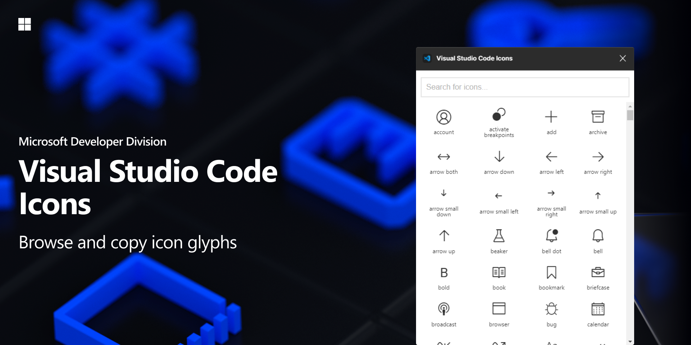

# Visual Studio Code Icons

Ensure you have the following fonts install in order to use the plugin in Figma:

- [Codicons](https://github.com/microsoft/vscode-codicons/blob/master/dist/codicon.ttf)
- [Seti](https://github.com/jesseweed/seti-ui/blob/master/styles/_fonts/seti/seti.ttf)

# Usage
1. Install [plugin](https://www.figma.com/community/plugin/786075219184960694/Visual-Studio-Code-Icons)
2. Find the symbol you want to use
3. Click the symbol